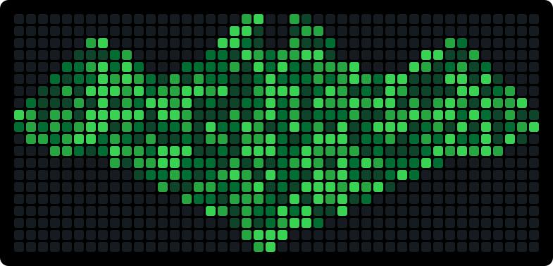

# Hi, I'm Abdullah 👋

I'm currently working on my own projects and helping others. I'm learning everything in IT. Ask me about IT.

## Projects

More info and live demos: [Abdullah.dev](https://abdullah.dev)

<strong>Car Rental System</strong> — Freelance (Fullstack) · Jul 2026 – Present

- Built a car rental website with React and TypeScript for the frontend and Node.js for the backend
- Implemented a booking flow for selecting a car, date, and rental period
- Connected the system to a database to manage availability, customers, and bookings

<strong>Invoice & Order System with Automated Analysis</strong> — Freelance (Fullstack) · Jun 2026 – Present

- Built a system for managing invoices, orders, and stock levels using HTML, CSS, and JavaScript for the frontend and Node.js with MySQL for the backend
- Implemented automatic balance calculation and order data analysis
- Integrated Python with an OCR library to automatically recognize and read invoices
- Combined multiple technologies (web + Python/OCR) into one coherent solution for the client

<strong>E-Commerce Site</strong> — Freelance (Fullstack) · Jun 2026

- Built an e-commerce site with HTML, CSS, and JavaScript for the frontend and Node.js for the backend
- Connected the application to a MySQL database to manage products, customers, and orders
- Implemented product catalog, cart, and order management from scratch through launch

<strong>Portfolio / Business Website</strong> — Freelance (Frontend) · Jun 2026

- Designed and developed a responsive business website with HTML, CSS, and JavaScript
- Tailored design and content to the client's brand and target audience
- Ensured fast load times and mobile responsiveness with no frameworks or backend

<strong>Multiplayer Game with Client/Server Architecture</strong> — University Project (KTH) · Mar 2026 – May 2026

- Developed a multiplayer game in C with SDL2 for graphics and rendering
- Implemented network communication between client and server for real-time updates between players
- Handled game state synchronization and user input over the network

## Contact

Reach me: abhasan@kth.se or Abdullah.dev

---

  

